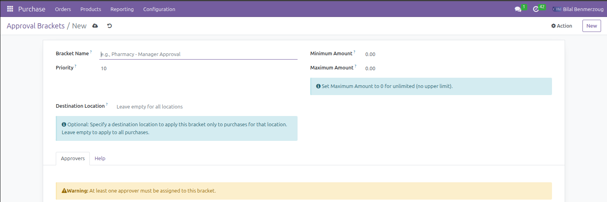
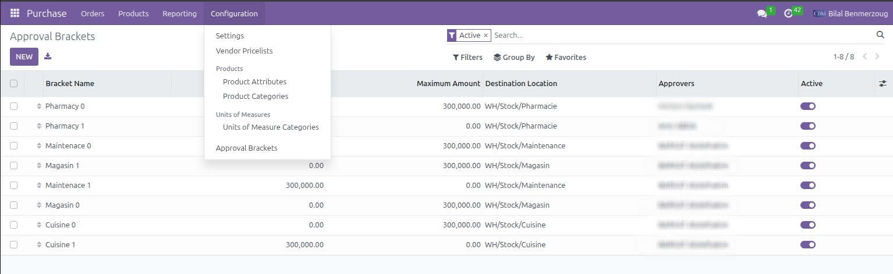
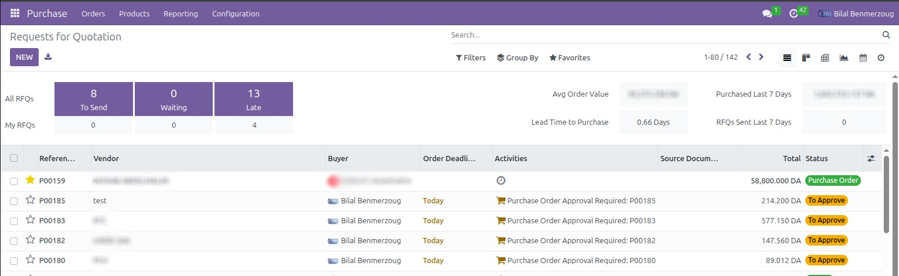

# Purchase Approval Bracket

## Overview
This module implements a flexible multi-level approval system for purchase orders based on configurable amount brackets. Each bracket can have different approvers and can optionally be linked to specific locations (e.g., Pharmacy, Magasin).

## Features
- Configurable Approval Brackets: Define multiple brackets with minimum and maximum amounts.
- Multiple Approvers: Assign multiple users as approvers per bracket (any can approve).
- Location-Specific Brackets: Optional location filtering (e.g., Pharmacy has different limits than Magasin).
- Global Brackets: Apply brackets to all purchases (leave location empty).
- Automatic Notifications: Odoo activities sent to approvers when approval is required.
- Smart Button Control: "Confirm Order" button disabled for regular users, enabled for approvers.
- Approval Feedback: Original user notified when PO is approved or cancelled.
- Priority Sequencing: Control which bracket applies when multiple match (lowest sequence wins).
- Multi-Currency Support: Works with all currencies (defaults to DZD).

## How It Works
### Workflow
1. User creates a Purchase Order:
   - Selects supplier, products, quantities.
   - Optionally selects a Destination Location.
   - Clicks "Confirm Order".
2. System checks if the PO amount matches any bracket:
   - Matches based on amount range (min ≤ amount ≤ max), location (if specified), and company.
   - Selects the highest priority bracket (lowest sequence).
3. If no bracket matches:
   - PO is confirmed (normal flow).
4. If a bracket matches:
   - If the user is an approver: PO is approved and confirmed, creator is notified.
   - If the user is not an approver: PO is set to "Pending Approval", "Confirm Order" button is disabled, and approvers are notified.
5. Approver reviews the PO:
   - Clicks "Approve" to confirm the PO or "Cancel" to reject it.
   - Creator is notified of the decision via Odoo activity.

## Installation
1. Clone the module: `git clone https://github.com/xmoroix/purchase-approval-bracket.git`
2. Add to Odoo addons path: `/path/to/odoo/addons/sttl_purchase_approval_bracket/`
3. Restart Odoo server: `sudo systemctl restart odoo`
4. Go to Apps > Update Apps List > Install "Purchase Approval Bracket"

## Configuration
Navigate to: **Purchase > Configuration > Approval Brackets**

Click **Create** and configure:

### Example 1: Global Bracket for All Purchases
- Name: Manager Approval Required
- Sequence: 10
- Minimum Amount: 30,000.00 DZD
- Maximum Amount: 100,000.00 DZD
- Destination Location: (leave empty)
- Approvers: Manager User 1, Manager User 2
- **Result**: Any PO with amount between 30,000 and 100,000 DZD requires approval from Manager User 1 or Manager User 2.

### Example 2: Location-Specific Bracket
- Name: Pharmacy - Owner Approval
- Sequence: 5 (higher priority)
- Minimum Amount: 100,000.00 DZD
- Maximum Amount: 0 (unlimited)
- Destination Location: WH/Stock/Pharmacy
- Approvers: Owner User
- **Result**: Any PO for Pharmacy location with amount ≥ 100,000 DZD requires approval from Owner User.

## Usage
### For Regular Users (Creating POs)
1. Navigate to **Purchase > Orders > Requests for Quotation**
2. Click **Create**
3. Fill in purchase details:
   - Vendor
   - Products and quantities
   - Destination Location (optional - affects which bracket applies)
4. Click **Confirm Order**
5. If approval is required:
   - Error message: "Purchase Order requires approval. Amount: 50,000.00 DZD, Bracket: Manager Approval, Approvers: Manager A, Manager B. Notification has been sent to approvers."
   - PO goes to "Pending Approval" state, "Confirm Order" button is disabled.
   - Wait for approver notification.
6. If no approval is required:
   - PO confirms normally.

### For Approvers (Approving POs)
1. Receive an Odoo Activity notification:
   - Example: "Purchase Order Approval Required: PO00123. Purchase Order PO00123 from John Doe requires your approval. Supplier: ABC Pharmaceuticals, Total Amount: 50,000.00 DZD, Destination Location: WH/Stock/Pharmacy, Bracket: Manager Approval. Please review and approve this purchase order."
2. Click the notification to open the PO.
3. Review the purchase order details.
4. To Approve:
   - Click "Approve and Confirm" button.
   - PO is confirmed, creator receives notification: "Your PO has been approved by [Your Name]."
5. To Reject:
   - Click "Cancel" button.
   - PO is cancelled, creator receives notification: "Your PO has been cancelled by [Your Name]."

## Screenshots
- **Application Icon**: Module icon displayed in Odoo Apps.
  
- **Bracket Configuration**: Configuring approval brackets with amount ranges and approvers.
  
- **Bracket List**: View all configured approval brackets.
  
- **To Be Approved Purchases**: List of purchase orders pending approval.
  

## Support
Contact: admin@adoctor.org
Response time: Within 48 hours

## Author
Bilal Benmerzoug

## License
LGPL-3

## Version
16.0.1.0.0 (Compatible with Odoo 16)